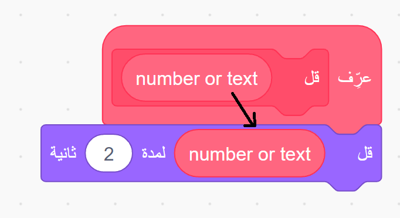
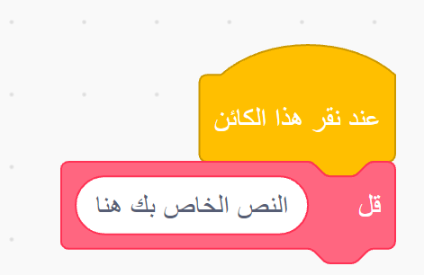

### اصنع كتلة برمجية

+ اذهب إلى القسم **لبناتي** وانقر فوق **إنشاء لبنة**.

+ قم بتسمية التعليمة البرمجية الجديدة الخاصة بك ، ثم انقر فوق **موافق**.

+ سوف تشاهد `تعريف الكتلة` الجديدة. إرفاق التعليمات البرمجية لهذه الكتلة.

+ يمكنك بعد ذلك استخدام كتلة جديدة مثل أي كتلة عادية.

+ يتم تشغيل التعليمة البرمجية المرفقة `تعريف` جديد كلما تم استخدام الكتلة.

### إنشاء كتلة مع معطيات

+ يمكنك أيضًا إنشاء كتل بها "فجوات" لإضافة البيانات. تسمى هذه "الفجوات" "معطيات". To add parameters, first make a new block, and then click on the options below to choose the type of data you want to add. Then give your data a name, and click **OK**.

+ You will see a new `define` block as usual, except that this one contains the data gap you added and which you gave a name.

+ You can then use your new block, filling in data in the gap.

+ As usual, the code attached to your new `define` block is run whenever the block is used.

