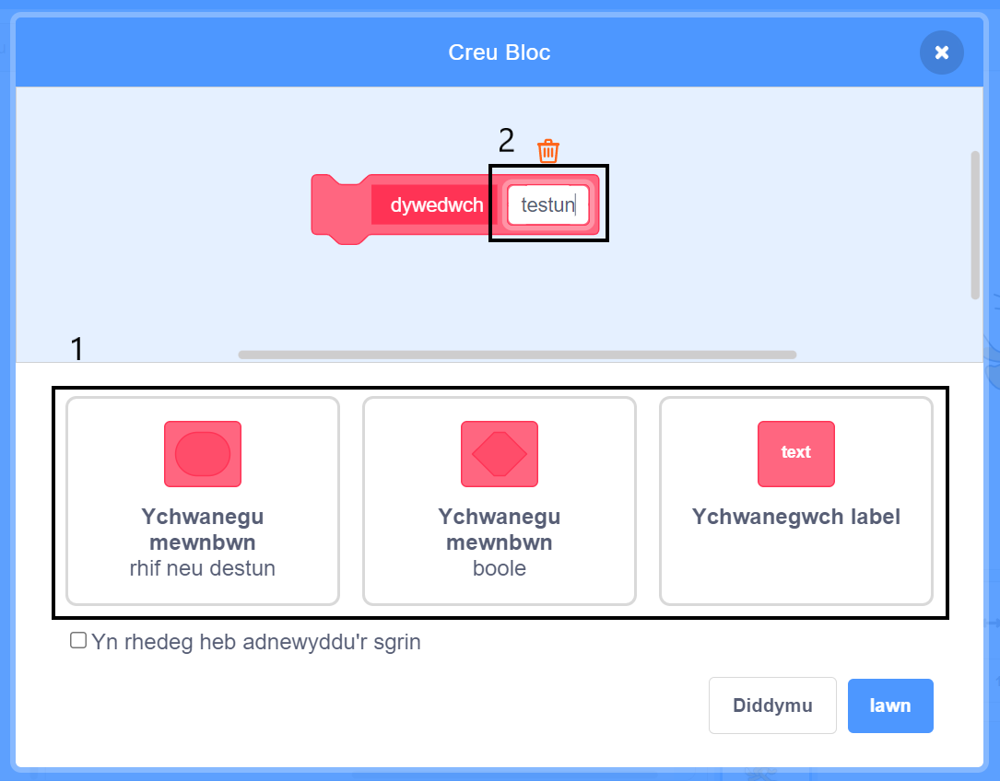

### Gwneud bloc

+ Clicia ar **Fy Mlociau**, ac yna clicia **Creu Bloc**.

+ Rho enw i dy floc newydd ac wedyn clicio **OK**.

+ Byddi di'n gweld bloc `diffinio` newydd. Atoda'r cod i'r bloc hwn.

+ Galli di wedyn ddefnyddio dy floc newydd yn union fel unrhyw floc arferol.

+ Mae'r cod sydd ynghlwm wrth dy floc `diffinio` newydd yn cael ei redeg pryd bynnag mae'r bloc yn cael ei ddefnyddio.

### Gwneud bloc gyda pharamedrau

+ Galli di hefyd greu blociau sydd â 'bylchau' ar gyfer ychwanegu data. Gelwir y 'bylchau' hyn yn 'baramedrau'. I ychwanegu paramedrau, gwna floc newydd yn gyntaf, ac yna clicio ar y dewisiadau isod i ddewis y math o ddata rwyt ti am ei ychwanegu. Yna rho enw i dy ddata, a chlicio **OK**.

+ Byddi di'n gweld bloc `diffinio` newydd fel arfer, ond bydd gan yr un yma y bwlch data wnes di ei ychwanegu ac enwi.

+ Galli di ddefnyddio dy floc newydd wedyn, gan lenwi data yn y bwlch.

+ Fel arfer, mae'r cod sydd ynghlwm wrth dy floc `diffinio` newydd yn cael ei redeg pryd bynnag mae'r bloc yn cael ei ddefnyddio.

