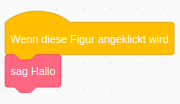
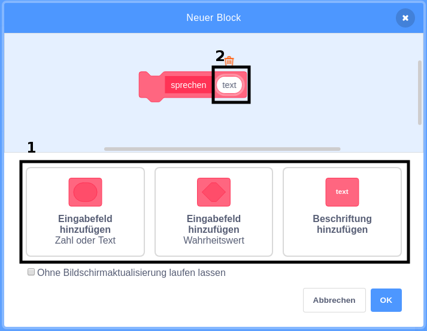

### Einen Block machen

+ Klicke auf **Meine Blöcke** und dann auf **Neuer Block**.

+ Gib deinem neuen Block einen Namen und klicke dann auf **OK**.

+ Du siehst einen neuen Block `Definiere`. Hänge Code an diesen Block an.

+ Du kannst deinen neuen Block dann wie jeden normalen Block verwenden.

+ Der an deinen neuen `Definiere` Block angehängte Code wird immer dann ausgeführt, wenn der Block verwendet wird.

### Einen Block mit Parametern erstellen

+ Du kannst auch Blöcke mit "Lücken" zum Hinzufügen von Daten erstellen. Diese "Lücken" werden "Parameter" genannt. Um Parameter hinzuzufügen, erstelle zunächst einen neuen Block und klicke anschließend auf eine der folgenden Optionen, um den Typ der Daten auszuwählen, die du hinzufügen möchtest. Dann gibst du deinen Daten einen Namen und klickst auf **OK**.

+ Du erhältst einen neuen `Definiere` Block wie üblich, mit der Ausnahme, dass dieser eine Datenlücke enthält, die du hinzugefügt hast und der du einen Namen gegeben hast.

+ Du kannst dann deinen neuen Block verwenden, indem Du Daten in die Lücke einfügst.

+ Wie üblich wird der an deinen neuen `Definiere` Block angehängte Code immer dann ausgeführt, wenn der Block verwendet wird.

