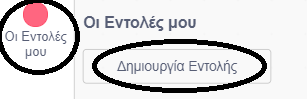
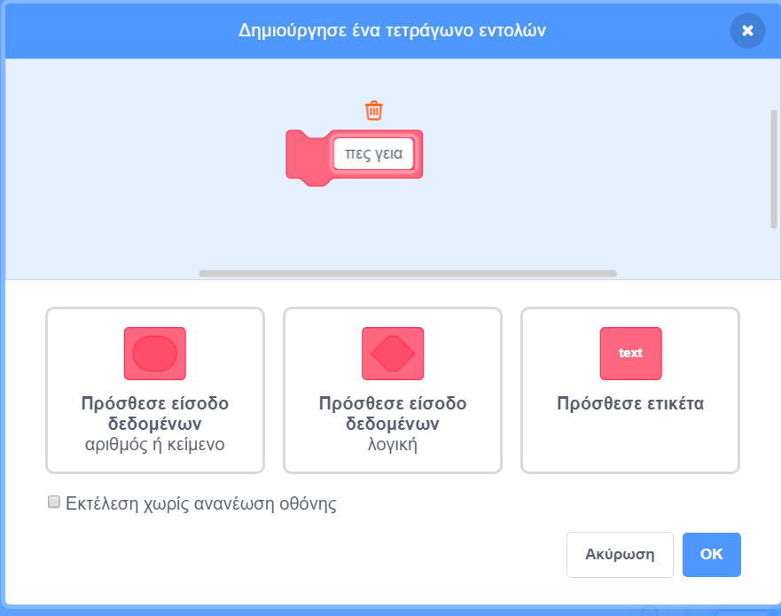
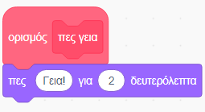
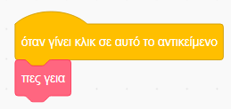
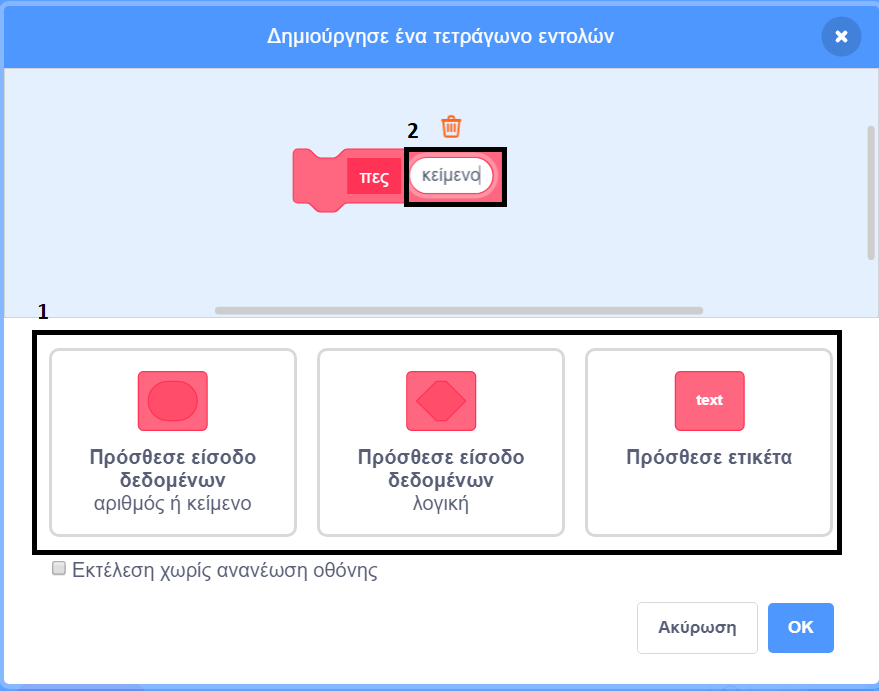
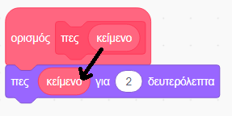
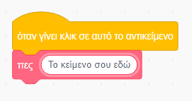

### Δημιουργία Εντολής

+ Κάνε κλικ στην καρτέλα **Οι Εντολές μου**, και μετά επίλεξε τη **Δημιουργία Εντολής**.

+ Δώσε ένα όνομα στη νέα εντολή και, στη συνέχεια, κάνε κλικ στο **OK**.

+ Θα δεις ένα νέο μπλοκ `ορισμός`. Βάλε κώδικα σε αυτό το μπλοκ.

+ Στη συνέχεια, μπορείς να χρησιμοποιείς το νέο σου μπλοκ όπως κάθε κανονικό μπλοκ.

+ Ο κώδικας που θα βάλεις στο μπλοκ `ορισμός` εκτελείται όποτε χρησιμοποιείται το μπλοκ αυτό.

### Δημιουργία Εντολής με παραμέτρους

+ Μπορείς επίσης να δημιουργήσεις εντολές που έχουν «κενά» πεδία για την προσθήκη δεδομένων. Αυτά τα «κενά» ονομάζονται «παράμετροι». Για να προσθέσεις παραμέτρους, δημιούργησε πρώτα μια νέα Εντολή και, στη συνέχεια, κάνε κλικ στις παρακάτω επιλογές για να επιλέξεις τον τύπο δεδομένων που θέλεις να προσθέσεις. Στη συνέχεια, δώσε στα δεδομένα σου ένα όνομα και κάνε κλικ στο **OK**.

+ Θα δεις ένα νέο μπλοκ `ορισμός` ως συνήθως, το οποίο όμως περιέχει ένα «κενό» για τα δεδομένα που πρόσθεσες και στα οποία έδωσες ένα όνομα.

+ Στη συνέχεια, μπορείς να χρησιμοποιείς το νέο σου μπλοκ, συμπληρώνοντας δεδομένα στο κενό.

+ Όπως και πριν, ο κώδικας που θα βάλεις στο μπλοκ `ορισμός` εκτελείται όποτε χρησιμοποιείται το μπλοκ αυτό.

