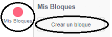
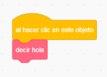

### Hacer un bloque

+ Haz clic en **Mis bloques** y luego haz clic en **Crear un bloque**.

+ Dale un nombre a tu nuevo bloque y haz clic en **De acuerdo**.

+ Verás un nuevo bloque `definir`. Fija un código a este bloque.

+ Ahora puedes usar tu nuevo bloque como cualquier bloque normal.

+ El código adjunto a tu nuevo bloque `definir` se ejecuta cada vez que se utiliza el bloque.

### Hacer un bloque con parámetros

+ También puedes crear bloques que tengan 'espacios' para agregar datos. Estos 'espacios' se llaman 'parámetros'. Para agregar parámetros, primero crea un nuevo bloque y luego haz clic en las opciones de abajo para elegir el tipo de datos que deseas agregar. Luego da un nombre a tus datos y haz clic en **De acuerdo**.

+ Verás un nuevo bloque `definir` como de costumbre, excepto que éste contiene el espacio de datos que has añadido y al que has dado un nombre.

+ Luego puedes usar tu nuevo bloque, al rellenar los datos en el espacio.

+ Como de costumbre, el código adjunto a tu nuevo bloque `definir` se ejecuta cada vez que se utiliza el bloque.

