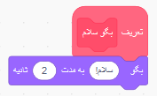

### ایجاد یک قطعه

+ روی **قطعه‌های من** کلیک کنید و سپس روی **ایجاد یک قطعه** کلیک کنید.

+ قطعه جدید خود را نامگذاری کنید و سپس روی **تایید** کلیک کنید.

+ شما یک بلوک `تعریف` جدید را می‌ببینید. کد را به این قطعه اضافه کنید.

+ حال می‌توانید از قطعه‌ی خود مانند هر قطعه‌ی دیگری استفاده کنید.

+ کد متصل به قطعه‌ی `تعریف` جدید شما، هر زمان که قطعه استفاده شود، اجرا می‌شود.

### ساخت یک قطعه با پارامترها

+ شما همچنین می‌توانید قطعه‌هایی بسازید که دارای 'محلی' برای اضافه کردن اطلاعات هستند. این 'محل‌ها'، 'پارامترها' نامیده می‌شوند. برای اضافه کردن پارامترها، ابتدا یک قطعه جدید ایجاد کنید و سپس بر روی گزینه‌های زیر کلیک کنید تا نوع داده ای را که می‌خواهید اضافه کنید، انتخاب نمایید. سپس داده‌ی خود را نامگذاری کنید و روی **تایید** کلیک کنید.

+ شما یک قطعه‌ی `تعریف` جدید را مطابق معمول خواهید دید، به جز اینکه این یکی دارای محل داده‌ای است که شما اضافه کرده‌اید و آن را نامگذاری نموده‌اید.

+ بعد از این می‌توانید از قطعه‌ی جدید خود استفاده کنید و داده را در محل وارد کنید.

+ طبق معمول، کد متصل به قطعه‌ی `تعریف` شما، هر زمان که از قطعه استفاده شود، اجرا می‌شود.

