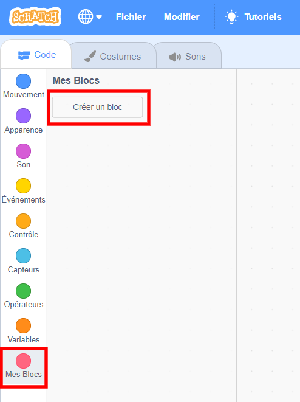
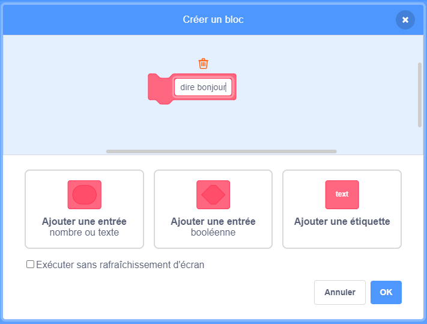
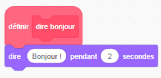
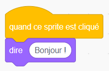
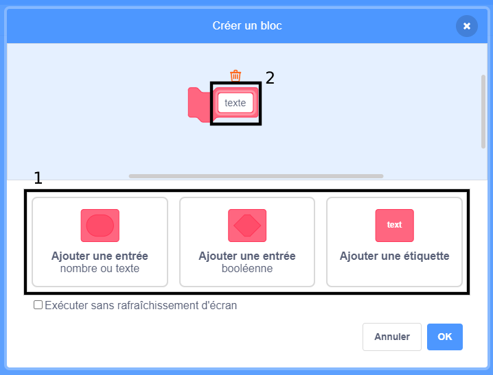
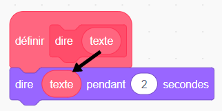
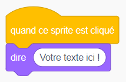

### Créer un bloc

+ Clique sur **Mes Blocs**, puis clique sur **Créer un Bloc**.

+ Donne un nom à ton nouveau bloc, puis clique sur **OK**.

+ Tu verras un nouveau bloc `définir`. Attache le code à ce bloc.

+ Tu peux alors utiliser ton nouveau bloc comme n'importe quel bloc normal.

+ Le code attaché à ton nouveau bloc `définir` est exécuté chaque fois que le bloc est utilisé.

### Créer un bloc avec des paramètres

+ Tu peux également créer des blocs qui ont des « espaces » pour ajouter des données. Ces « espaces » sont appelés « paramètres ». Pour ajouter des paramètres, crée d'abord un nouveau bloc, puis clique sur les options ci-dessous pour choisir le type de données que tu souhaites ajouter. Ensuite, donne un nom à tes données et clique sur **OK**.

+ Tu verras un nouveau bloc `définir` comme d'habitude, excepté que celui-ci contient l'espace de données que tu as ajouté et auquel tu as donné un nom.

+ Tu peux ensuite utiliser ton nouveau bloc, en remplissant les données dans l'espace.

+ Comme d'habitude, le code attaché à ton nouveau bloc `définir` est exécuté chaque fois que le bloc est utilisé.

