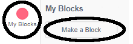
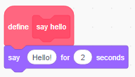
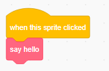

### Block बनाना

+ **My Blocks** पर क्लिक करें, और फिर **Make a Block** क्लिक करें।

+ अपने नए block को कोई नाम दें और फिर **OK** पर क्लिक करें।

+ आपको एक नया `define` block दिखाई देगा। इस block में code संलग्न करें।

+ फिर आप अपने नए block का उपयोग किसी भी सामान्य block की तरह कर सकते हैं।

+ जब भी इस block का उपयोग किया जाता है तो आपके नए `define` block से संलग्न कोड चलाया जाता है।

### पैरामीटरों वाला एक block बनाना

+ डेटा जोड़ने के लिए आप ऐसे blocks भी बना सकते हैं जिनमें 'फ़ासला' (gaps) हों। ये 'खाली जगहें' 'पैरामीटर' (parameters) कहलाती हैं। पैरामीटर जोड़ने के लिए, पहले एक नया block बनाएँ, और फिर आप जिस प्रकार का डेटा जोड़ना चाहते हैं उसे चुनने के लिए नीचे दिए गए विकल्पों पर क्लिक करें। फिर अपने डेटा को कोई नाम दें, और **OK** पर क्लिक करें।

+ आपको हमेशा की तरह एक नया `define` block दिखाई देगा, सिवाय इसके कि इसमें आपके द्वारा जोड़ी गई डेटा की खाली जगह शामिल है और जिसे आपने कोई नाम दिया है।

+ फिर आप खाली जगह में डेटा को भरते हुए, अपने नए block का उपयोग कर सकते हैं।

+ हमेशा की तरह, जब भी इस block का उपयोग किया जाता है तो आपके नए `define` block से संलग्न कोड चलाया जाता है।

