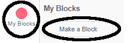
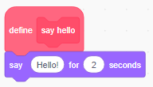
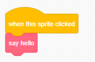

### ಒಂದು ಬ್ಲಾಕ್ ಮಾಡುವುದು

+ ಕ್ಲಿಕ್ ಮಾಡಿ **My Blocks**, ನಂತರ ಕ್ಲಿಕ್ ಮಾಡಿ **Make a Block**.

+ ನಿಮ್ಮ ಹೊಸ ಬ್ಲಾಕ್ ಹೆಸರು ನೀಡಿ ಮತ್ತು ನಂತರ ಕ್ಲಿಕ್ ಮಾಡಿ **OK**.

+ ನೀವು ನೋಡುತ್ತೀರಾ ಹೊಸ `define` ಬ್ಲಾಕ್. ಈ ಬ್ಲಾಕ್‌ಗೆ ಕೋಡ್ ಲಗತ್ತಿಸಿ.

+ ನಂತರ ನೀವು ಯಾವುದೇ ಹೊಸ ಬ್ಲಾಕ್‌ನಂತೆಯೇ ನಿಮ್ಮ ಹೊಸ ಬ್ಲಾಕ್ ಅನ್ನು ಬಳಸಬಹುದು.

+ ನಿಮ್ಮ ಹೊಸ `define` ಬ್ಲಾಕ್ ಗೆ ಲಗತ್ತಿಸಲಾದ ಕೋಡ್ ಅನ್ನು ಬಳಸಿದಾಗಲೆಲ್ಲಾ ಬ್ಲಾಕ್ ಅನ್ನು ರನ್ ಮಾಡಲಾಗುತ್ತದೆ.

### ಪ್ಯಾರಾಮೀಟರ್ ಇಂದ ಬ್ಲಾಕ್ ಮಾಡುವುದು

+ ಡೇಟಾವನ್ನು ಸೇರಿಸಲು 'ಗಪ್ಸ್'(ಅಂತರಗಳು) ಹೊಂದಿರುವ ಬ್ಲಾಕ್‌ಗಳನ್ನು ಸಹ ನೀವು ರಚಿಸಬಹುದು. ಈ 'ಗಪ್ಸ್'(ಅಂತರಗಳು) ಅನ್ನು 'ಪ್ಯಾರಾಮೀಟರ್' ಎಂದು ಕರೆಯಲಾಗುತ್ತದೆ. ಪ್ಯಾರಾಮೀಟರ್ ಸೇರಿಸಲು, ಮೊದಲು ಹೊಸ ಬ್ಲಾಕ್ ಮಾಡಿ, ತದನಂತರ ನೀವು ಸೇರಿಸಲು ಬಯಸುವ ಡೇಟಾದ ಪ್ರಕಾರವನ್ನು ಆಯ್ಕೆ ಮಾಡಲು ಕೆಳಗಿನ ಆಯ್ಕೆಗಳ ಮೇಲೆ ಕ್ಲಿಕ್ ಮಾಡಿ. ನಂತರ ನಿಮ್ಮ ಡೇಟಾಗೆ(data) ಹೆಸರನ್ನು ನೀಡಿ, ಮತ್ತು ಕ್ಲಿಕ್ ಮಾಡಿ ** ok **.

+ ನೀವು ನೋಡುವಿರಿ ಹೊಸ `define` ಬ್ಲಾಕ್ ಎಂದಿನಂತೆ ನೋಡುತ್ತೀರಾ, ಅದು ಬಿಟ್ಟು ಇದು ನೀವು ಸೇರಿಸಿದ ಡೇಟಾ ಗ್ಯಾಪ್ ಹಾಗೂ ನೀವು ಕೊಟ್ಟ ಹೆಸರು ಹೊಂದಿರುತ್ತದೆ.

+ ನಂತರ ನೀವು ನಿಮ್ಮ ಹೊಸ ಬ್ಲಾಕ್ ಅನ್ನು ಬಳಸಬಹುದು, ಅಂತರದಲ್ಲಿ ಡೇಟಾವನ್ನು ಭರ್ತಿ ಮಾಡಿ.

+ ಎಂದಿನಂತೆ, ಕೋಡ್ ಲಗತ್ತಿಸಲಾದ ನಿಮ್ಮ ಹೊಸ `define` ಬ್ಲಾಕ್ ರನ್(ಓಡು) ಆಗಿದೆ ಬ್ಲಾಕ್ ಅನ್ನು ಬಳಸಿದಾಗಲೆಲ್ಲಾ.

