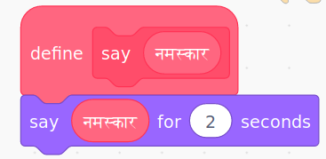
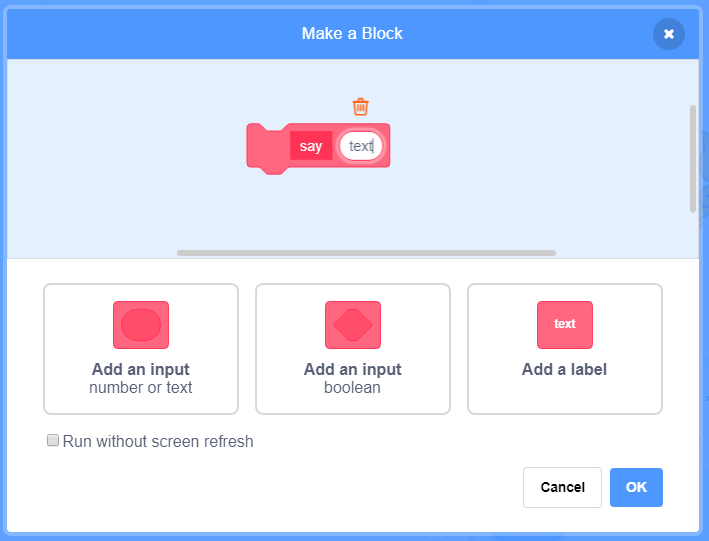

### ब्लॉक बनवणे

+ **My Blocks**वर क्लिक करा आणि नंतर **Make a Block**वर क्लिक करा.

+ आपल्या नवीन ब्लॉकला एक नाव द्या आणि नंतर **OK** वर क्लिक करा.

+ आपल्याला एक नवीन `define` ब्लॉक दिसेल. या ब्लॉकमध्ये कोड संलग्न करा.

+ आपण नंतर आपला नवीन ब्लॉक कोणत्याही सामान्य ब्लॉकसारखे वापरू शकता.

+ जेव्हा आपला ब्लॉक वापरला जातो तेव्हा आपल्या नवीन `define` ब्लॉकशी संलग्न केलेला कोड चालविला जातो.

### पॅरामीटर्ससह ब्लॉक करणे

+ आपण डेटा जोडण्यासाठी 'अंतर' असलेले ब्लॉक देखील तयार करू शकता. या 'अंतरांना' 'पॅरामीटर्स' म्हणतात. पॅरामीटर्स जोडण्यासाठी, प्रथम नवीन ब्लॉक बनवा आणि नंतर आपण जो डेटा जोडू इच्छिता तो निवडण्यासाठी खालील पर्यायांवर क्लिक करा. मग आपला डेटाला एक नाव द्या आणि **OK** क्लिक करा.

+ आपल्याला नेहमीप्रमाणे एक नवीन `define` ब्लॉक दिसेल, याशिवाय त्यात आपण जोडलेले डेटा अंतर आणि आपण दिलेले नाव दिसेल.

+ आपण नंतर अंतर मध्ये डेटा भरून, आपला नवीन ब्लॉक वापरू शकता.

+ नेहमीप्रमाणे, जेव्हा आपला ब्लॉक वापरला जातो तेव्हा आपल्या नवीन `define` ब्लॉकशी संलग्न केलेला कोड चालविला जातो.

