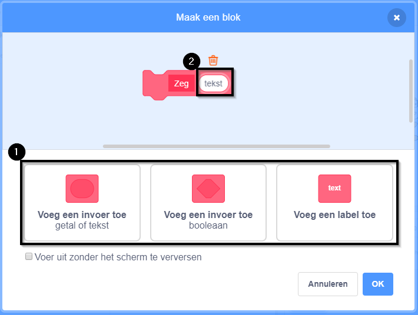

### Een blok maken

+ Klik op **Mijn blokken** en klik vervolgens op **Maak een blok**.

+ Geef je nieuwe blok een naam en klik vervolgens op **OK**.

+ Je ziet een nieuw `definieer` blok. Voeg code toe aan dit blok.

+ Je kunt je nieuwe blok dan gebruiken zoals elk normaal blok.

+ De code die gekoppeld is aan je nieuwe `definieer` blok wordt uitgevoerd wanneer dit blok wordt gebruikt.

### Een blok met parameters maken

+ Je kan ook blokken maken met 'gaten' om gegevens toe te voegen. Deze 'gaten' worden 'parameters' genoemd. Als je parameters wilt toevoegen, moet je eerst een nieuw blok maken en vervolgens op de onderstaande opties klikken om het type gegevens te kiezen dat je wilt toevoegen. Geef vervolgens je parameter een naam en klik op **OK**.

+ Je zult een nieuw `definieer` blok zien zoals gebruikelijk, behalve dat deze het door jou toegevoegde gegevensgat en de door jou gekozen naam bevat.

+ Je kunt dan je nieuwe blok gebruiken en de gegevens in het gat invullen.

+ Zoals gewoonlijk wordt de code, die is gekoppeld aan je nieuwe `definieer` blok, uitgevoerd wanneer het blok wordt gebruikt.

