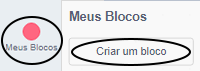
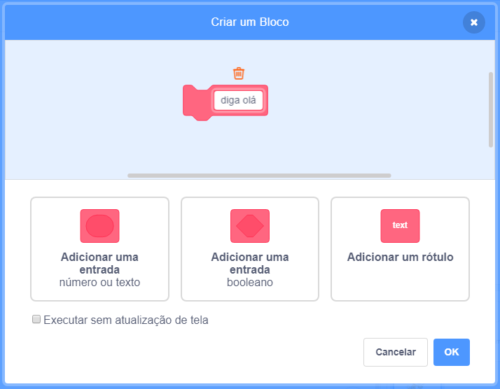
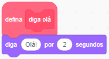
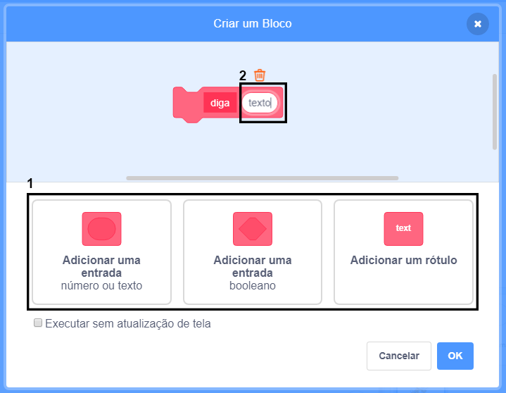
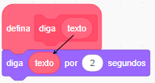

### Criando um bloco

+ Clique em **Meus Blocos**, e depois clique em **Criar um bloco**.

+ Dê um nome ao seu novo bloco e cliquei em **OK**.

+ Você verá um novo bloco `defina`. Anexe um código a este bloco.

+ Você pode usar seu novo bloco como qualquer outro bloco normal.

+ O código anexado ao seu novo bloco `defina` é executado sempre que o bloco é usado.

### Criando um bloco com parâmetros

+ Você também pode criar blocos que tenham "lacunas" para adicionar dados. Estas "lacunas" são chamadas de "parâmetros". Para adicionar parâmetros, primeiramente crie um novo bloco, e então clique em uma das opções abaixo para escolher o tipo do dado que você quer criar. Em seguida, dê um nome ao seu dado e clique em **OK**.

+ Você verá um novo bloco `defina` como de costume, exceto que este contém a lacuna de dados que você adicionou e deu um nome.

+ Você pode usar o seu novo bloco preenchendo os dados na lacuna.

+ Como de costume, o código anexado ao seu novo bloco `defina` será executado quando o bloco for utilizado.

