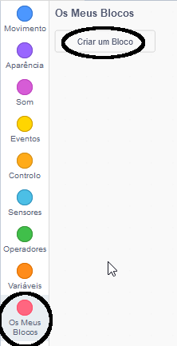
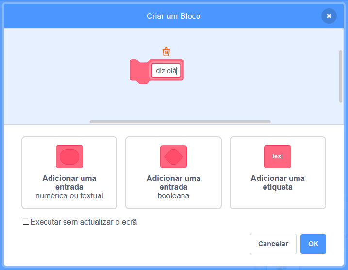
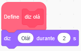
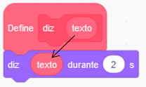

### Criar um Bloco

+ Clica em ** Os Meus blocos ** e, em seguida, clica em ** Criar um bloco **.

+ Dá um nome ao teu novo bloco e clica em ** OK. **.

+ Verás um novo bloco `Define`. Anexa código a este bloco.

+ Podes usar o teu novo bloco com outro qualquer bloco normal.

+ O código anexado ao teu novo bloco `define` será executado sempre que bloco for usado.

### Criar um bloco com parâmetros

+ Podes também criar blocos que tenham 'espaços' para adicionar dados. Estes 'espaços' são chamados de parâmetros. Para adicionar parâmetros, primeiro cria um novo bloco e depois clica nas opções em baixo para escolher o tipo de dados que desejas adicionar. Em seguida, dá um nome aos teus dados e clica em ** OK. **.

+ Verás um novo bloco ` define ` como de costume, excepto que este contém o espaço para os dados ao qual deste um nome.

+ Podes depois usar o teu novo bloco, preenchendo os espaços com dados.

+ Como de costume, o código anexado ao teu novo bloco `define` será executado sempre que bloco for usado.

