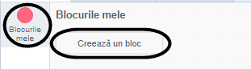
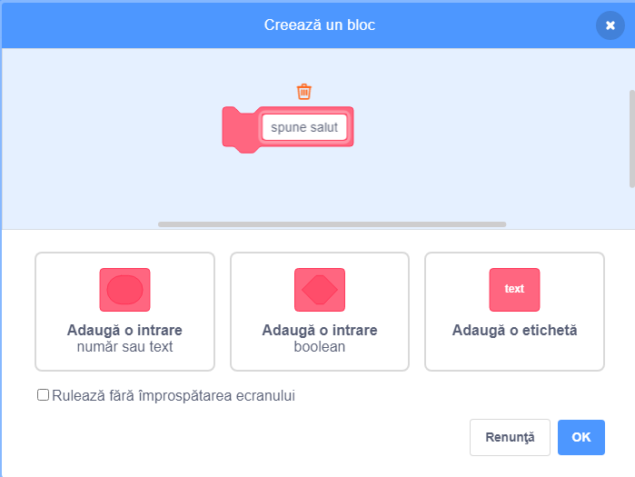
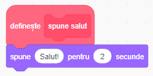
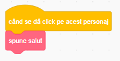
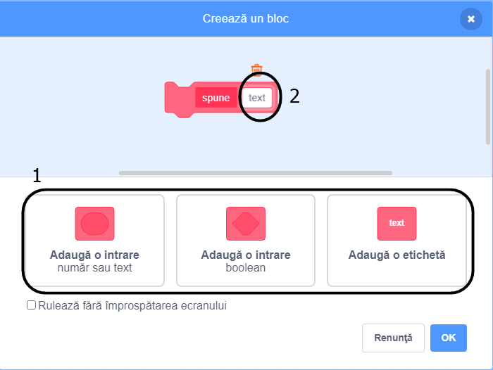
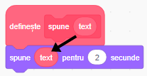
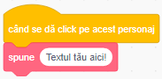

### Crearea unui bloc

+ Dă click pe **Blocurile mele**, iar apoi dă click pe **Creează un bloc**.

+ Dă-i noului tău bloc un nume, iar apoi dă click pe **OK**.

+ Vei vedea un nou bloc `definește`. Atașează codul acestui bloc.

+ Apoi, vei putea folosi noul tău bloc ca și un bloc normal.

+ Codul atașat noului tău bloc `definește` este rulat de fiecare dată când blocul este folosit.

### Crearea unui bloc cu parametri

+ Poți crea și blocuri care au „spații libere” pentru a adăuga date. Aceste „spații libere” se numesc parametri'. Pentru a adăuga parametri, creează un nou bloc, iar apoi dă click pe opțiunile de mai jos pentru a alege tipul datei pe care vrei să o adaugi. Apoi, oferă-i datei tale un nume, iar după dă click pe **OK**.

+ Vei vedea un nou bloc `definește` ca în cazul precedent, singura diferență fiind spațiul gol în plus pentru data pe care ai adăugat-o și căreia i-ai dat un nume.

+ Acum poți folosi noul tău bloc, completând cu date în spațiile goale.

+ Ca în mod normal, codul atașat noului tău bloc `definește` este rulat de fiecare dată când blocul este folosit.

