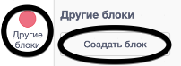
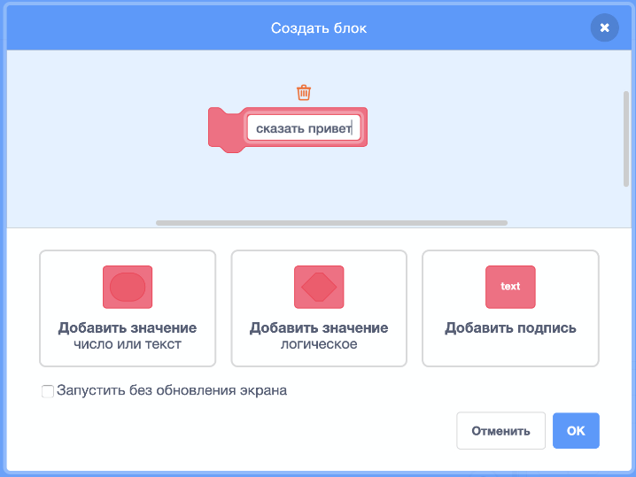
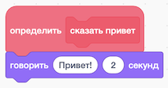
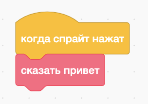
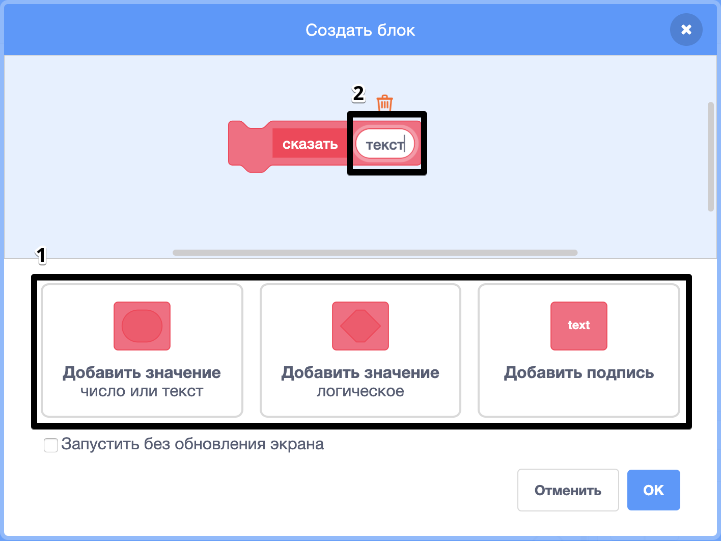
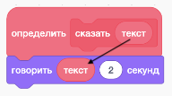
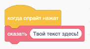

### Создание блока

+ Нажми на **Другие блоки**, а затем нажми **Создать блок**.

+ Дай твоему новому блоку имя и затем нажми **OK**.

+ Ты увидишь новый блок `определить`. Прикрепи код к этому блоку.

+ Затем ты можешь использовать свой новый блок, как и любой другой обычный блок.

+ Код, прикрепленный к твоему новому блоку `определить` запускается всякий раз, когда блок используется.

### Создание блока с параметрами

+ Ты также можешь создавать блоки с «пробелами» для принятия данных. Эти «пробелы» называются «параметрами». Чтобы добавить параметры, сначала создай новый блок, а затем из опций ниже выбери тип данных, которые ты хочешь добавить. Затем дай твоим данным имя и нажми **OK**.

+ Ты увидишь новый блок `определить` как обычно, за исключением того, что он содержит пробел в данных, который ты добавил и которому ты дал имя.

+ Затем ты можешь использовать свой новый блок, заполняя данные в пропусках.

+ Как обычно, код, присоединенный к твоему новому блоку `определить`, запускается всякий раз, когда блок используется.

