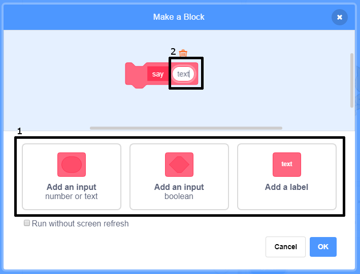

### කට්ටියක්(block එකක්) සෑදීම

+ ** මගේ කට්ටි(My Blocks)** මත ක්ලික් කරන්න, පසුව ** කට්ටියක් සාදන්න(Make a Block)** මත ක්ලික් කරන්න.

+ ඔබගේ නව කට්ටියට(block එකට) නමක් දී ** හරි(OK) ** ක්ලික් කරන්න.

+ ඔබට නව `නිර්වචනය(define)` කට්ටිය(block එක) පෙනෙනු ඇත. මෙම කට්ටිය(block) වෙත කේත(code) ඇමිණීම.

+ එවිට ඔබට ඕනෑම සාමාන්‍ය කට්ටියක්(block එකක්) මෙන් ඔබේ නව කට්ටිය(block) භාවිතා කළ හැකිය.

+ නව `නිර්වචන(define)` කට්ටියට(block) අමුණා ඇති කේතයන් එම කට්ටිය(block) භාවිතා කරන සැම විටම ධාවනයවේ(run).

### පරාමිතීන්(parameters) සහිත කට්ටියක්(block එකක්) සෑදීම

+ ඔබට දත්ත එකතු කිරීම සඳහා 'හිඩැස්(gaps)' ඇති කට්ටි(blocks) සෑදිය හැකිය. මෙම 'හිඩැස්(gaps)' පරාමිතීන්(parameters) ලෙස හැඳින්වේ. පරාමිතීන්(parameters) එක් කිරීම සඳහා පළමුව නව කට්ටියක්(block) සාදන්න, ඉන් අනතුරුව ඒ සඳහා අවශ්‍ය දත්ත(data) වර්ගය තෝරා ගැනීමට පහත දක්වා ඇති දත්ත(data) වර්ග වලින් අවශ්‍ය දත්ත(data) වර්ගය මත ක්ලික් කරන්න. ඉන්පසු ඔබේ දත්ත(data) වලට නමක් දී **හරි(OK)** මත ක්ලික් කරන්න.

+ ඔබට නව `නිර්වචනය(define)` කට්ටිය(block එක) සුපුරුදු පරිදි දැකගත හැක, නමුත් මෙහි ඔබ නමක් යෙදූ දත්ත(data) හිඩැස(gap) අඩංගු වේ.

+ ඔබට හිඩැස(gap) තුළ දත්ත(data) යොදා ඔබේ නව කට්ටිය(block එක) භාවිතා කළ හැකිය.

+ සුපුරුදු පරිදි, නව `නිර්වචන(define)` කට්ටියට(block එකට්) අමුණා ඇති කේතයන්(code) එම කට්ටිය(block) භාවිතා කරන සැම විටම ධාවනයවේ(run).

