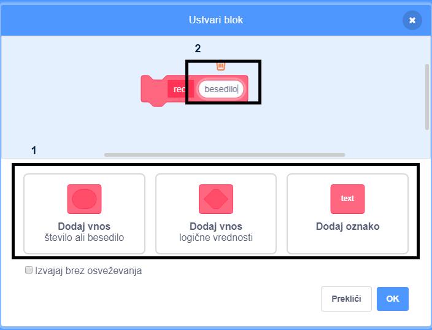

### Ustvarjanje bloka

+ Klikni na **Moji bloki** in nato klikni na **Ustvari blok**.

+ Poimenuj svoj blok in klikni **OK**.

+ Videl boš nov blok `definiraj`. Temu bloku dodaj kodo.

+ Novi blok lahko uporabiš kot katerikoli navaden blok.

+ Koda, ki je pripeta k bloku `definiraj`, se izvede, kadarkoli uporabiš ta blok.

### Ustvarjanje bloka s parametri

+ Lahko ustvariš tudi bloke, ki imajo 'luknje', v katere lahko dodaš podatke. Te 'luknje' se imenujejo parametri. Za dodajanje parametrov najprej ustvari nov blok in nato klikni na spodnje možnosti, da izbereš vrsto podatka, ki ga želiš dodati. Nato poimenuj tvoj podatek in klikni **OK**.

+ Kot ponavadi boš videl-a nov blok `definiraj`, le da ima ta luknjo za podatek, ki si ga dodal-a in poimenoval-a.

+ Nato lahko uporabljaš svoj blok, tako da dodaš podatke v luknjo.

+ Kot vedno, se koda, ki je pripeta bloku `definiraj`, izvede, kadar uporabiš ta blok.

