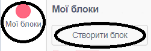
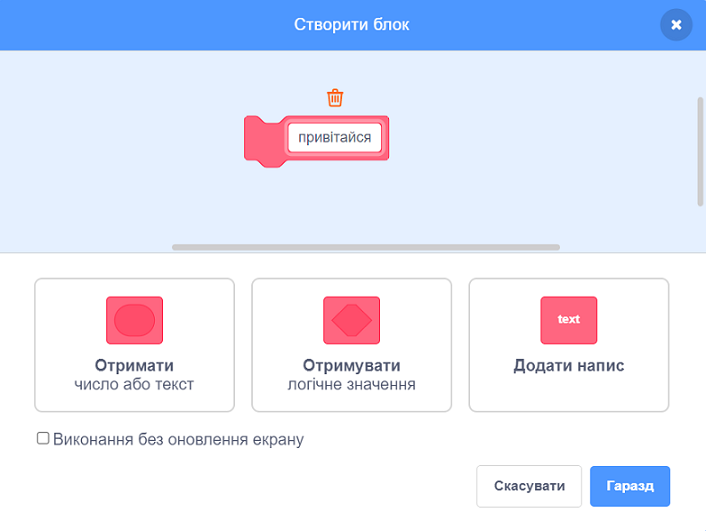
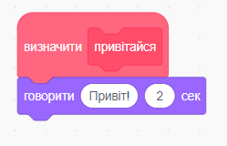
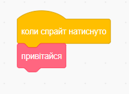
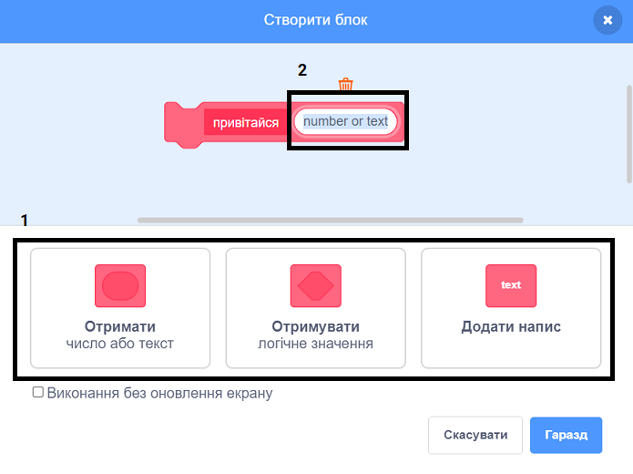
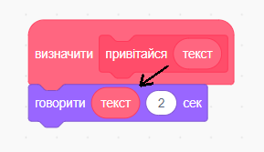
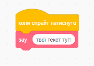

### Створення блоку

+ Натисни **Мої блоки**, і вибери **Створити блок**.

+ Дай своєму новому блоку назву і натисни **Гаразд**.

+ Ти побачиш новий `визначений` блок. Прикріпи код до цього блоку.

+ Далі ти можеш використовувати свій новий блок як будь-який звичайний блок.

+ Код, прикріплений до твого нового `визначеного` блоку, буде виконуватись при кожному наступному використанні цього блоку.

### Створення блоку з параметрами

+ Також можна створювати блоки з «пробілами» для додавання даних. Ці «пробіли» називаються «параметрами». Для додавання параметрів спочатку створи новий блок, а потім натисни опції нижче, щоб обрати тип даних, які ти хочеш додати. Далі дай своїм даним назву та натисни **Гаразд**.

+ Ти побачиш новий `визначений` код, як звичайно, за виключенням того, що він містить пробіл для даних, який ти додав і якому ти дав назву.

+ Далі ти можеш використовувати свій новий блок, заповнивши дані в пробілі.

+ Як звичайно, код, прикріплений до твого нового `визначеного` блоку, буде виконуватись при кожному наступному використанні цього блоку.

